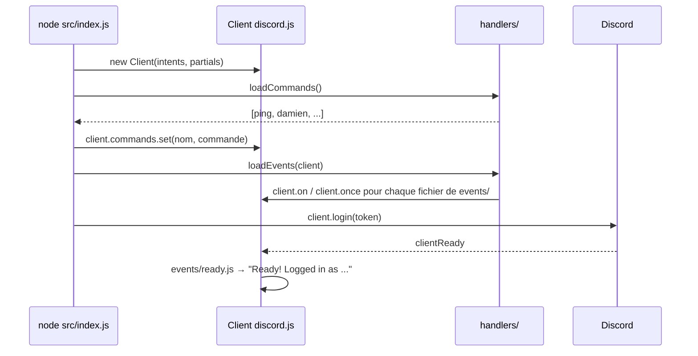
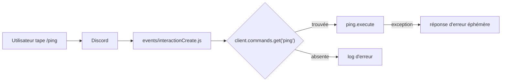

# Architecture

## Vue d'ensemble

Le bot est une application Node.js (CommonJS) basée sur **discord.js v14**. Le code est découpé par responsabilité :

```
discordBot/src/
├── index.js        # Point d'entrée
├── config.js       # Lecture de config.json
├── commands/       # Commandes slash (une par fichier, rangées par catégorie)
├── events/         # Réactions aux événements Discord (un événement par fichier)
├── handlers/       # Chargement automatique des commandes et des événements
├── services/       # Logique métier et appels aux API externes
└── prompts/        # Textes injectés dans le prompt de l'IA
```

| Dossier | Rôle | Dépend de |
|---|---|---|
| `commands/` | Définit ce que fait chaque commande slash | discord.js |
| `events/` | Reçoit les événements Discord et délègue aux services | `services/` |
| `handlers/` | Lit les dossiers `commands/` et `events/` et les branche sur le client | — |
| `services/` | Appels OpenRouter, Tavily, football-data ; mémoire de l'IA | `config.js` |
| `scripts/` | Outils lancés à la main (`deploy-commands`) | `handlers/`, `config.js` |

Règle générale : **les événements ne contiennent pas de logique métier**. Ils lisent l'entrée Discord, appellent un service et renvoient la réponse.

## Démarrage du bot



1. `index.js` crée le client avec ses intents et partials.
2. `loadCommands()` parcourt `src/commands/<catégorie>/*.js` et renvoie les commandes valides (qui exportent `data` et `execute`). Elles sont rangées dans `client.commands`, une `Collection` indexée par nom de commande.
3. `loadEvents(client)` branche chaque fichier de `src/events/` avec `client.on` (ou `client.once` si `once: true`).
4. `client.login(token)` connecte le bot. Discord déclenche ensuite `clientReady`.

## Traitement d'une commande slash



`interactionCreate` ignore tout ce qui n'est pas une commande slash, retrouve la commande dans `client.commands` puis appelle son `execute`. En cas d'exception, l'utilisateur reçoit un message d'erreur visible de lui seul.

## Intents et partials

Déclarés dans `src/index.js` :

| Intent | Pourquoi |
|---|---|
| `Guilds` | Accès aux serveurs et salons (requis par discord.js) |
| `GuildMessages` | Recevoir les messages des salons (`!ai`) |
| `MessageContent` | Lire le texte des messages. **Intent privilégié** : à activer dans le Developer Portal |
| `GuildMessageReactions` | Recevoir les réactions (non utilisé actuellement) |

Les partials (`Message`, `Reaction`, `User`, `Channel`) permettent de recevoir des événements sur des objets qui ne sont pas en cache, par exemple une réaction sur un ancien message.

## Fichiers de configuration

`src/config.js` charge `discordBot/config.json` avec un chemin absolu, le bot peut donc être lancé depuis n'importe quel dossier. Voir [Configuration](configuration.md).
