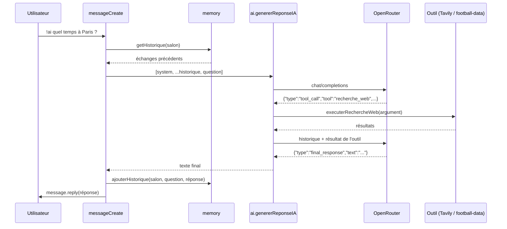

# Assistant IA (`!ai`)

L'assistant est un agent conversationnel : avant de répondre, le modèle peut décider d'utiliser un outil (recherche web ou données football), lire le résultat, puis rédiger sa réponse.

| Élément | Fichier |
|---|---|
| Réception du message, mémoire, réponse Discord | `src/events/messageCreate.js` |
| Prompt système, appel au modèle, boucle d'outils | `src/services/ai.js` |
| Outil `recherche_web` | `src/services/webSearch.js` |
| Outil `recherche_foot` | `src/services/football.js` |
| Documentation API football donnée au modèle | `src/prompts/foot.md` |
| Mémoire de conversation | `src/services/memory.js` |

## Trajet d'une question



1. `messageCreate` ignore les bots et ne réagit qu'aux messages commençant par `!ai `.
2. Il construit la liste de messages : prompt système, historique du salon, nouvelle question.
3. `genererReponseIA` interroge le modèle et traite les éventuels appels d'outils.
4. La question et la réponse finale sont mémorisées, puis la réponse est envoyée (coupée à 2000 caractères, la limite de Discord).

## Le protocole JSON

Le modèle n'utilise pas le *function calling* natif de l'API : le prompt système (`systemInstructions` dans `ai.js`) lui impose de **toujours répondre par un objet JSON**, sans texte autour.

Appel d'outil :
```json
{ "type": "tool_call", "tool": "recherche_web", "argument": "météo Paris aujourd'hui" }
```

Réponse finale :
```json
{ "type": "final_response", "text": "Il fait 14°C à Paris." }
```

| Réponse reçue | Comportement |
|---|---|
| `tool_call` + `recherche_web` | Lance la recherche, ajoute le résultat à l'historique, rappelle le modèle |
| `tool_call` + `recherche_foot` | Appelle l'URL fournie, ajoute le résultat, rappelle le modèle |
| `final_response` | Renvoie `text` |
| JSON valide mais type inconnu | Renvoie un message d'erreur générique |
| Pas du JSON | Renvoie le texte brut du modèle (mode de secours) |

## La boucle d'outils

`genererReponseIA(historiqueMessages, tentative)` est **récursive** : après chaque appel d'outil, elle ajoute deux messages à l'historique puis se rappelle avec `tentative + 1`.

```
assistant : {"type":"tool_call", ...}                 ← la demande du modèle
user      : [RÉSULTAT DE L'OUTIL '...'] : ...          ← le résultat injecté
```

Paramètres (dans `ai.js`) :

| Paramètre | Valeur |
|---|---|
| Modèle | `deepseek/deepseek-v4.1-flash` |
| Température | `0.2` |
| Tentatives maximum | `3` (au-delà, un message d'excuse est renvoyé) |

Une erreur HTTP d'OpenRouter ou une réponse vide lève une exception, rattrapée dans `messageCreate` qui affiche l'erreur dans le salon.

## Les outils

### `recherche_web` — Tavily

`executerRechercheWeb(argument)` envoie les mots-clés choisis par le modèle à l'API Tavily (`search_depth: basic`, 3 résultats) et renvoie pour chaque résultat le titre, l'URL et le contenu.

### `recherche_foot` — football-data.org

Le modèle **construit lui-même l'URL** de l'API. Pour cela, le contenu de `src/prompts/foot.md` (URL de base, endpoints, codes des compétitions) est injecté dans le prompt système.
`WorldCupIA(url)` appelle cette URL telle quelle avec la clé `FootballKey` et formate la liste des matchs (heure de Paris).

Pour ajouter une compétition, il suffit d'ajouter son code dans `foot.md`, puis de redémarrer le bot (le fichier est lu au démarrage).

## Mémoire de conversation

`src/services/memory.js` conserve l'historique **par salon** dans une `Map` en RAM :

```js
conversation: Map<channelId, { message: MessageIA[], lastMessage: number }>
```

| Constante | Valeur | Effet |
|---|---|---|
| `MAX_ECHANGE` | `10` | Nombre d'échanges (question + réponse) gardés par salon |
| `EXPIRATION_MEMOIRE` | 30 min | Inactivité après laquelle la mémoire du salon est effacée |

- `getHistorique(channelId)` renvoie une **copie** des messages. `genererReponseIA` ajoute les résultats d'outils dans le tableau reçu : grâce à la copie, ces résultats (volumineux) n'entrent jamais dans la mémoire.
- `ajouterHistorique(channelId, question, reponse)` ajoute l'échange, ne garde que les `MAX_ECHANGE` derniers et remet le délai d'expiration à zéro.
- Un échange qui se termine en erreur n'est pas mémorisé.

La mémoire est partagée par tous les membres du salon et perdue à chaque redémarrage du bot.

## Coût en tokens

Chaque appel envoie : le prompt système (dont `foot.md`), jusqu'à 20 messages d'historique, la question, et les éventuels résultats d'outils de la question en cours. Le prompt système étant identique d'un appel à l'autre, il bénéficie du cache de préfixe du fournisseur.

## Limites connues

- **Date figée** : `today` est calculé au démarrage. Si le bot tourne plusieurs jours sans redémarrer, le modèle a une date fausse.
- **URL football non vérifiée** : l'URL produite par le modèle est appelée sans contrôle de domaine.
- **Espace en tête de question** : `message.content.slice(3)` conserve l'espace qui suit `!ai`.
- **Réponses longues tronquées** : au-delà de 2000 caractères, la fin de la réponse est perdue.
- **Mémoire volatile** : vidée à chaque redémarrage, donc à chaque déploiement.
