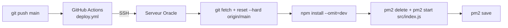

# Déploiement

Le bot tourne sur un serveur **Oracle Cloud** (Ubuntu), géré par **PM2**. Le déploiement est automatique à chaque push sur `main`.

## Pipeline



Le workflow [`.github/workflows/deploy.yml`](../.github/workflows/deploy.yml) se connecte en SSH avec `appleboy/ssh-action`, puis exécute dans `~/DiscordSafe/discordBot` :

| Étape | Commande | Effet |
|---|---|---|
| 1 | `git fetch --all && git reset --hard origin/main` | Aligne le serveur sur `main` (toute modification locale est écrasée) |
| 2 | `npm install --omit=dev` | Installe les dépendances de production (sans `jsdoc`) |
| 3 | `pm2 delete mon-bot \|\| true` | Supprime l'ancien processus s'il existe |
| 4 | `pm2 start src/index.js --name mon-bot` | Lance le bot |
| 5 | `pm2 save` | Enregistre la liste des processus pour un redémarrage du serveur |

Le processus est supprimé puis recréé (plutôt que `pm2 restart`) pour que PM2 prenne toujours le bon fichier d'entrée.

## Secrets GitHub

À définir dans **Settings → Secrets and variables → Actions** du dépôt :

| Secret | Contenu |
|---|---|
| `SERVER_IP` | Adresse IP publique du serveur |
| `SSH_PRIVATE_KEY` | Clé privée SSH autorisée pour l'utilisateur `ubuntu` |

## Prérequis sur le serveur

- Node.js 18 ou plus récent (le code utilise `fetch` natif)
- PM2 installé globalement : `npm install -g pm2`
- Le dépôt cloné dans `~/DiscordSafe`
- `~/DiscordSafe/discordBot/config.json` présent et rempli (il n'est pas dans Git) — voir [Configuration](configuration.md)
- Pour relancer PM2 au redémarrage du serveur : `pm2 startup` (une seule fois)

## Ce qui n'est pas automatique

- **Les commandes slash** : après une modification de commande, lancer `npm run deploy-commands` (en local ou sur le serveur).
- **`config.json`** : une nouvelle clé doit être ajoutée à la main sur le serveur.

## Commandes PM2 utiles

```bash
pm2 status              # état des processus
pm2 logs mon-bot        # logs en direct
pm2 logs mon-bot --lines 100
pm2 restart mon-bot     # redémarrer (ex. après modification de config.json)
pm2 stop mon-bot
```

## Dépannage

| Symptôme | Piste |
|---|---|
| Le workflow échoue à l'étape SSH | Vérifier `SERVER_IP`, `SSH_PRIVATE_KEY` et que le port 22 est ouvert dans les règles Oracle |
| `Cannot find module '../config.json'` | `config.json` absent de `~/DiscordSafe/discordBot/` |
| Le bot est en ligne mais `!ai` ne répond pas | Intent **Message Content** désactivé dans le Developer Portal |
| `!ai` répond « Erreur OpenRouter: 401 » | Clé `OpenRouteur` invalide ; « 402 » : crédit épuisé |
| Une commande slash n'apparaît pas | `npm run deploy-commands` non lancé, ou propagation en cours |
| Le bot ne revient pas après un redémarrage du serveur | `pm2 startup` puis `pm2 save` non effectués |
